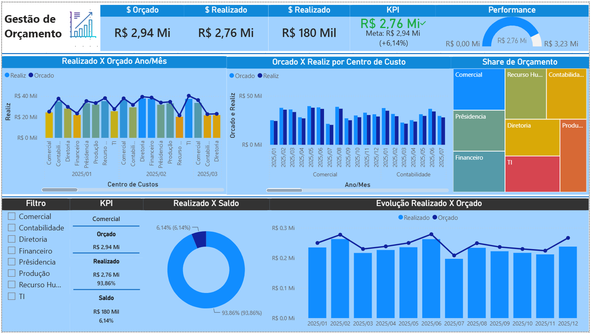

# 📊 Dashboard de Gestão Orçamentária

## 📌 Sobre o projeto

Este projeto foi desenvolvido em Power BI com o objetivo de analisar o desempenho orçamentário de diferentes centros de custos, permitindo acompanhar indicadores financeiros e comparar os valores orçados e realizados ao longo do tempo.

O dashboard foi criado como parte dos meus estudos em Business Intelligence (BI), recebendo adaptações e melhorias próprias, incluindo atualização da base de dados, personalização dos visuais e reorganização do layout.

---

## 🚀 Tecnologias utilizadas

- Power BI Desktop
- DAX
- Power Query
- Microsoft Excel

---

## 📈 Indicadores

- Valor Orçado
- Valor Realizado
- Saldo
- % Realizado
- % Saldo

---

## 📊 Funcionalidades

- Filtro por Centro de Custos
- Comparação entre Orçado x Realizado
- Evolução mensal dos gastos
- KPIs financeiros
- Treemap de participação por Centro de Custos
- Gráficos interativos

---

## 🖼️ Dashboard



---

## 📂 Estrutura do projeto

```
📁 powerbi-gestao-orcamento
│
├── Dashboard.pbix
├── BaseDados.xlsx
├── README.md
└── imagens
    └── dashboard-principal.png
```

---

## 👩‍💻 Autora

Aline Yamada Barbosa

Em transição para a área de Business Intelligence, desenvolvendo projetos práticos em Power BI, SQL e análise de dados.
